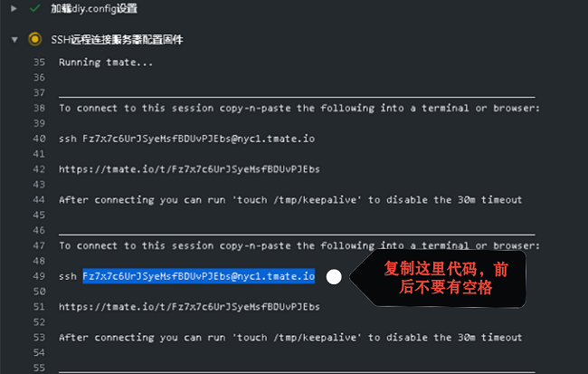
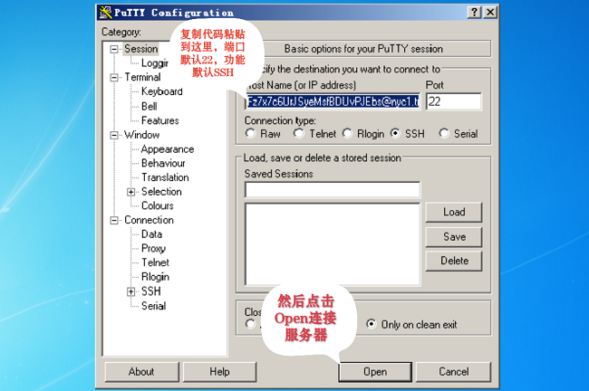
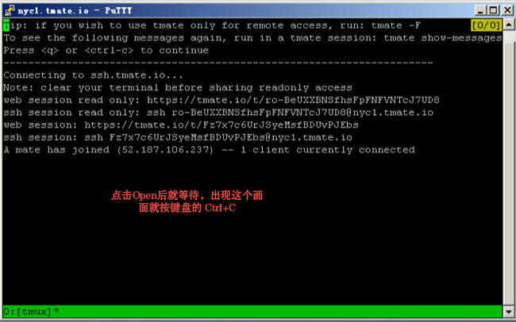
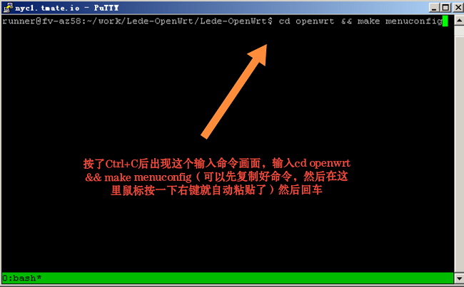
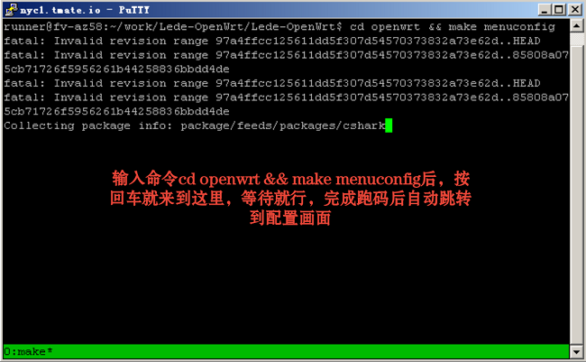
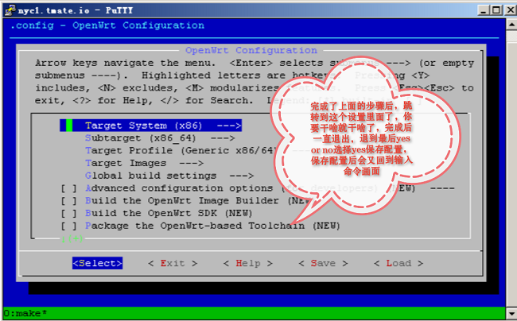
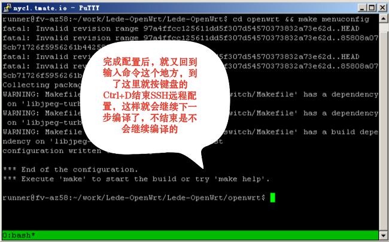

# SSH连接说明：
- cd openwrt && make menuconfig
#
- SSH连接说明：复制代码-->粘贴到putty开始连接-->等待跑码完成-->按Ctrl+c-->输入cd openwrt && make menuconfig然后回车-->等待跑码完成进入配置画面-->配置完成后-->一路Exit退出配置界面-->Ctrl+d结束SSH连接
#
- 必定要正确结束SSH连接才会继续编译，不结束的话，或者打开SSH后没管的话，30分钟后编译失败
#

#
# - [SSH工具下载](https://www.chiark.greenend.org.uk/~sgtatham/putty/releases/0.74.html)
