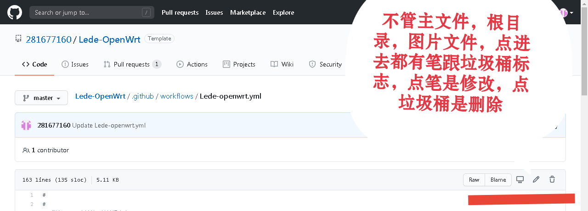
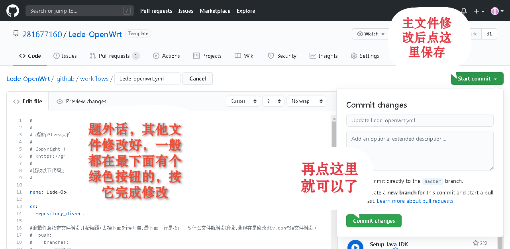
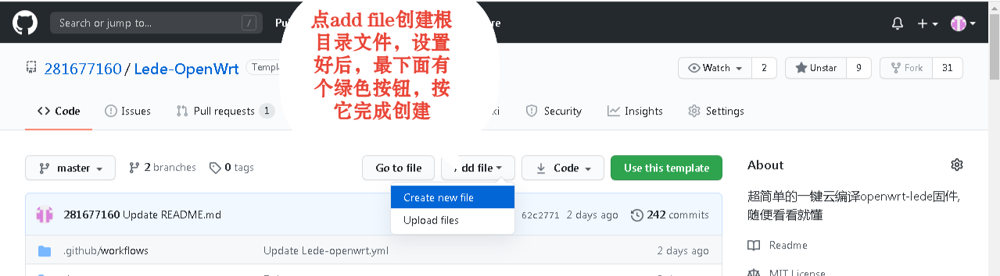
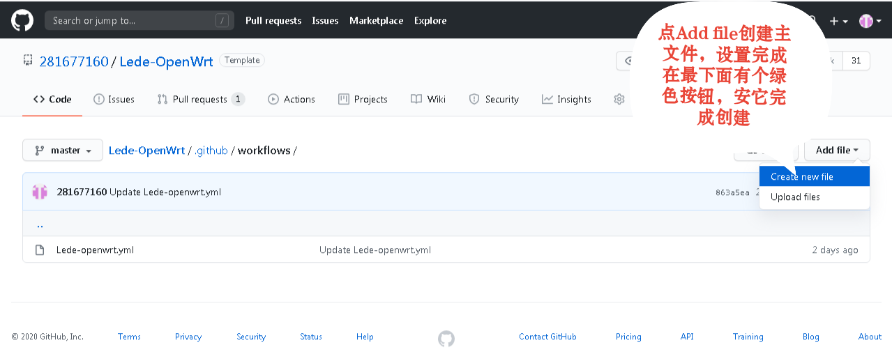
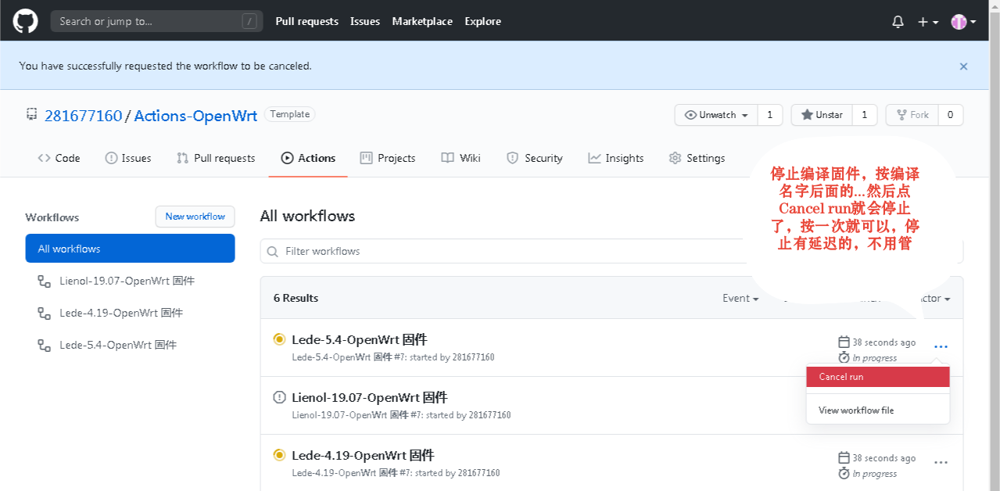
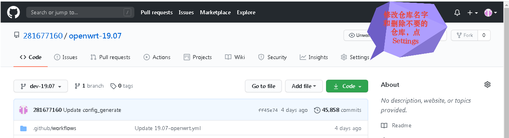
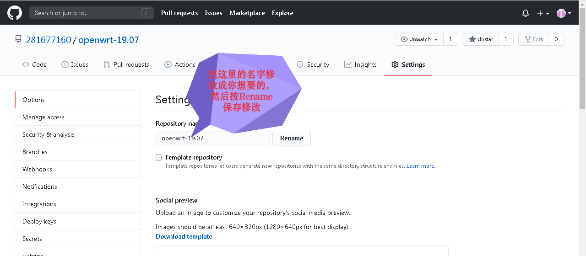
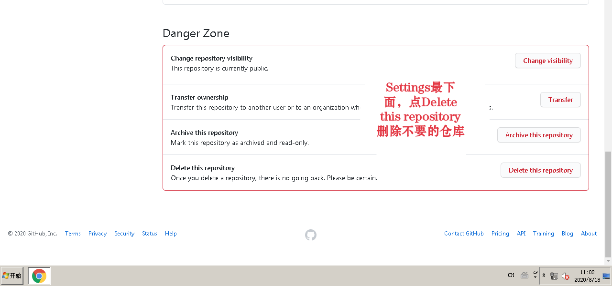
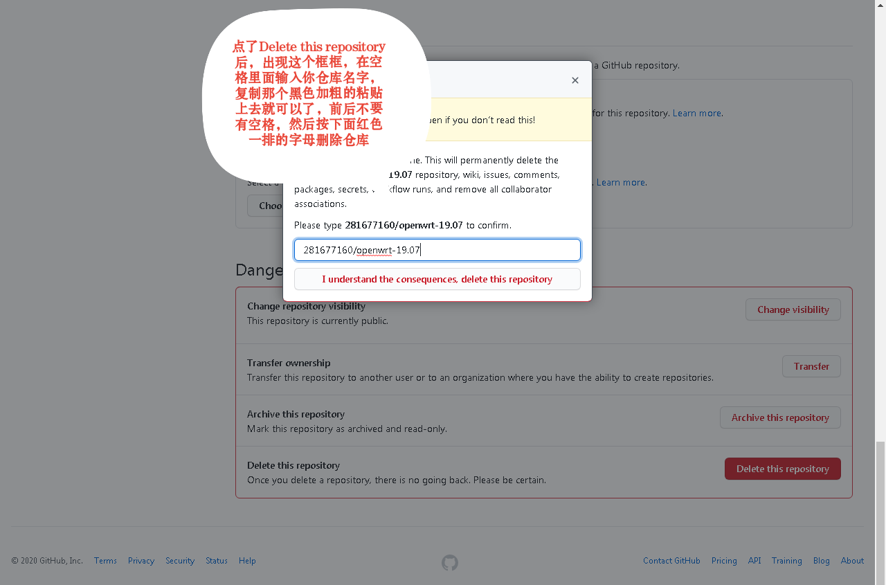
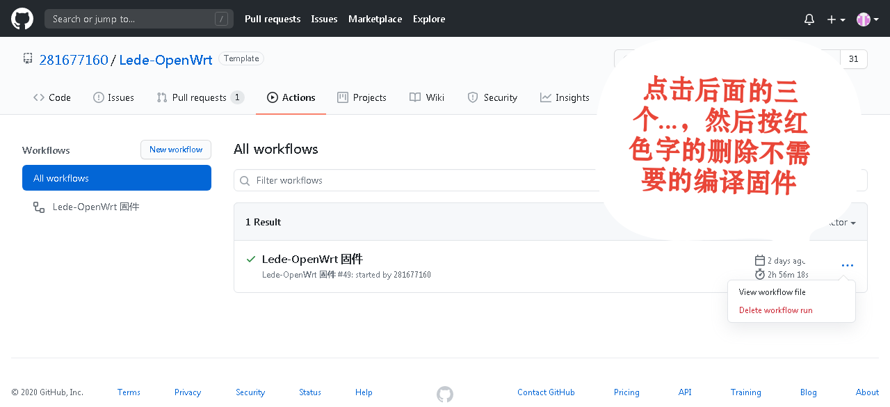

# 删除和修改文件说明：
#

#
#
#
# 创建文件
- 在你拉取我仓库后的首页上点击Add file可以创建.sh跟.config文件
#

#
#
#
- 在你拉取我仓库后的首页的《.github/workflows》里面可以创建.yml主文件
#

#
#
#
# 停止正在运行点编译

#
#
#
# 修改仓库名字

#
#
#
# 删除不要点仓库

#
#
#
#
# 删除编译了后，或者编译失败，不需要的固件

